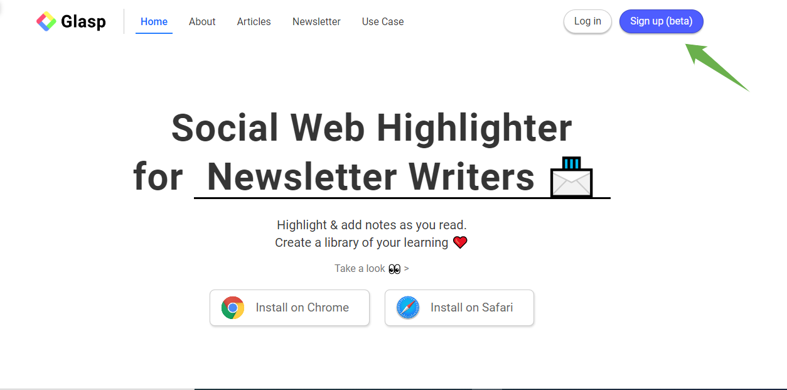
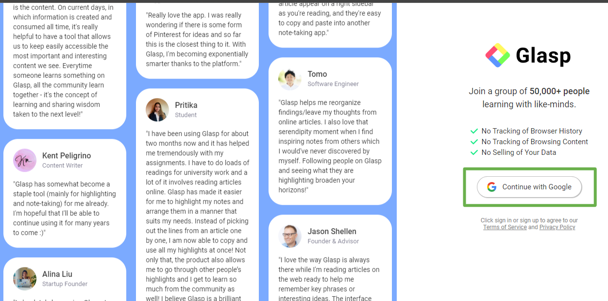
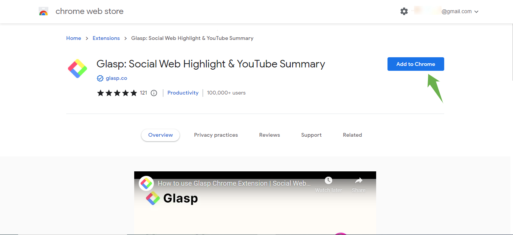
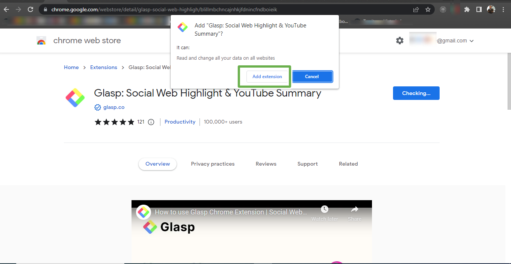
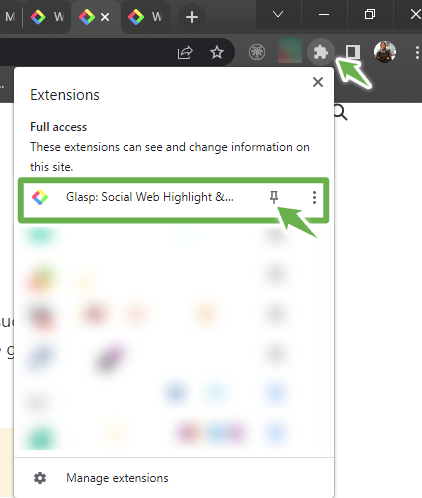
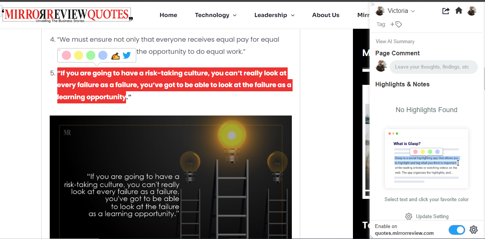
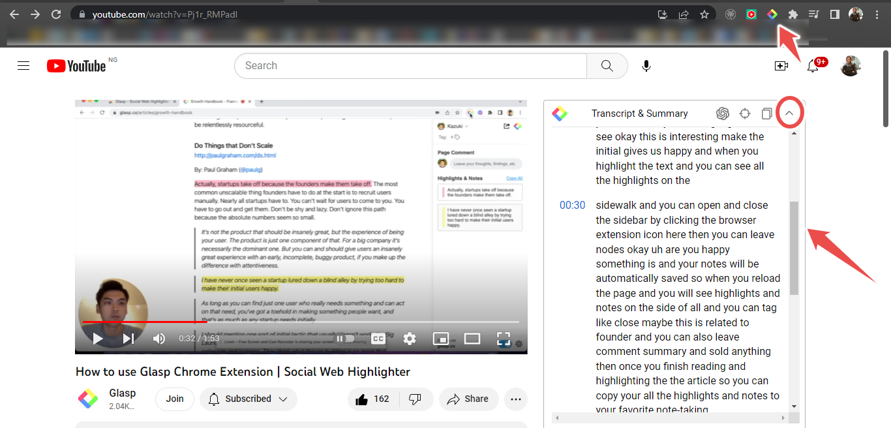
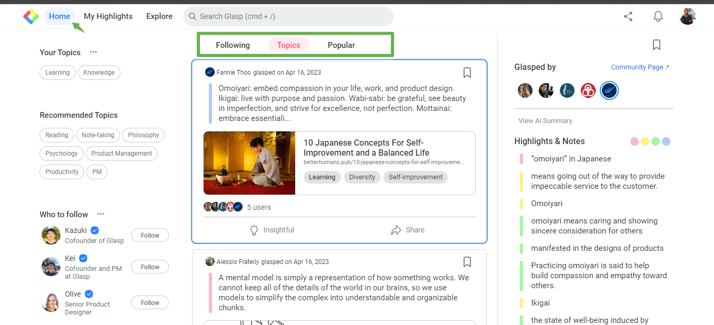
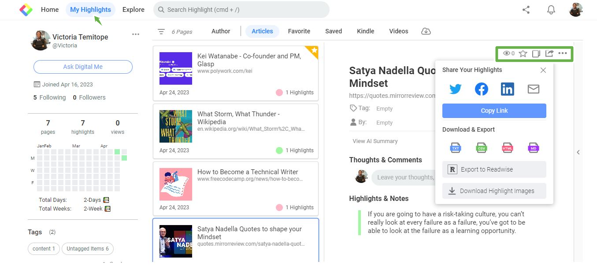

 ## **Unique Features of Glasp, the Social Media Highlighter**

### **TABLE OF CONTENTS**

### **Introduction**

### **Installation**

### **How Glasp Works**

### **Glasp Integrations and Features**

### **Pricing and Profile Page**

### **Comments from Glasp users**

### **Glasp alternatives**

### **Conclusion**

### **Introduction**

Highlighting a section of a book is a fun way to reference. How about highlighting quotes read online? This is where Glasp comes in. 

[Glasp](http://glasp.co/) is an online highlighter for the
web. Glasp is an abbreviation for "Greatest Legacy Accumulated as Shared
Proof."

Glasp was founded in 2021 by [Kazuki
Nakayashiki](https://glasp.co/#/kazuki) and [Kei
Watanabe](https://glasp.co/#/kei). Kazuki is the current
CEO of Glasp. [Kazuki stated why they built
Glasp](https://glasp.co/articles/why-are-we-building-glasp)
in a quote: "***Creating a system that allows everyone to share and
develop their learnings as their legacy in a natural way***."

Users from all over the world can highlight text on the web with Glasp.
Glasp permits highlighting on numerous websites, including
[Forbes](https://www.forbes.com/) and
[Wikipedia](https://www.wikipedia.org/). There is a
community of Glasp users, which helps in collaboration, interactions,
and networking. Quotes highlighted by other users can be viewed. Glasp
gives access to people's thoughts and learning.

### **Installation**

How do you install Glasp and start highlighting? Glasp is available for
download on desktop computers using
[Windows](https://chrome.google.com/webstore/detail/glasp-social-web-highligh/blillmbchncajnhkjfdnincfndboieik)
and
[Mac](https://apps.apple.com/us/app/glasp-social-web-highlighter/id1605690124?mt=12)
OS. However, it is unavailable for Android and iOS devices currently.
Glasp works as an extension in web browsers. Web pages can be
highlighted on web browsers that have the extension installed.

To install Glasp, you can follow these steps:

-   Sign up with your email address on the [Glasp
    Website](http://glasp.co/).

> 
>
> 

-   Once sign-up is complete, select "Add to Chrome." There would be a pop-up to add the extension. For example, a teaching video is accessible from the Glasp YouTube page to learn how to install the extension.
> 
  

-   Pin the Extension on Chrome

> 

### **How Glasp Works**
Glasp is free to use. It can be accessed on desktop PCs using browsers
such as Chrome, Safari, Edge, Brave, Vivaldi, and Opera. Glasp is
currently in the beta version. You can highlight articles or videos on
the web. It helps with organizing your thoughts and referencing things
online.

Glasp, however, has restrictions on highlighting websites. Some
websites, including Google products, note-taking apps, banking apps, and
local PDF files, cannot be highlighted based on [security
reasons](https://blog.glasp.co/disabled-domains/).

To start highlighting, follow these steps:

-   Open the article or PDF of your choice.

-   Select the words you want to highlight.

-   Choose the color of the highlight. Four colors are available to select from. They are pink, yellow, green, and blue. Notes can be added while highlighting and shared directly on Twitter.

-   The text would show on the right. Comments can be added to the highlight.

### **Glasp Integrations and Features**

Glasp has distinctive features that make it easy to use. The parts are
as follows:

**Youtube Transcript Highlight**

Glasp offers the option to highlight YouTube transcripts. It provides an
extension called the [YouTube Summary with
ChatGPT](https://glasp.co/ai-summary). Glasp provides the
transcripts with the time stamps of the videos. To get the transcript,
open a YouTube video on the browser where the extension is installed.
The transcript and summary section on the right would appear. It
captures the transcripts with the time stamp of the video. The
transcript can be copied.

**Kindle integration**

Highlights and notes can be imported from Kindle into Glasp. To do this,
open Kindle; at the top right, there is an option to "[Copy Highlights or Select Books](https://twitter.com/_Glasp/status/1564108203368910848)."
Select the books of your choice to import. Select "import Glasp." The books would appear in the "Kindle" section of the profile page. Notes
highlighted on books on your Kindle app would show on Glasp.

**Quoteshots**

[Quotes](https://twitter.com/_Glasp/status/1574573919557734402)
and words highlighted can be shared as quotes on social media pages such
as Twitter, LinkedIn, and Facebook. The highlights can be downloaded and
exported in comma-separated values (CSV), TXT, HTML, and Markdown
formats.

**Embed Glasp Highlights in a Blog**

Highlights saved on Glasp can easily be
[embedded](https://twitter.com/_Glasp/status/1539742066808623104)
into blogs such as Hashnode, Medium, and personal blogs.

**PDF Highlight**

[PDFs](https://www.youtube.com/watch?v=ng1hP5v0ceE) hosted
online can be highlighted easily.

### **Pricing and Profile Page**

[Glasp pricing](https://glasp.co/articles/best-online-highlighters)
is currently free and has no premium subscriptions for users.

Once sign-up is complete, you can begin to highlight pages. Glasp
automatically creates a social media profile consisting of three
sections: Home, My Highlights, and Explore.

-   [**Home**](https://glasp.co/home)

> 

The home page shows accounts to follow, topics of interest, and popular
highlights by other users. Here, you can find your highlights based on
your topics of interest. For example, you can find highlights from other
users.

On the 'Following" page, quotes highlighted by accounts you follow would
be for public view.

-   **My Highlights**

>

Highlights and notes are stored on the profile page of the Glasp
website. They can be accessed in the "My Highlights" section. Selected
highlights can be tagged as favorites, copied, and shared. You can share
highlights on Twitter, Facebook, LinkedIn, and via mail.

"Download Highlight images" would download the highlight as a quote.
Various colors range from black, blue, and pink to the quote's
background.

> 

-   [Explore](https://glasp.co/explore/)

> 

The Explore page shows authors or websites. The authors or websites are
Glasp users or websites. These Glasp users have their websites and pages
highlighted. You can connect to their social media accounts. Highlighted
pages relating to the hashtags show on the page when clicked. Content
from the community can be found here.

### **Comments from Glasp users**

Business executives and writers who have implemented and used Glasp
claim that they did so because of the community, unique highlights, and
easy-to-use interface.

*"Glasp has already become a staple tool (mainly for highlighting and
note-taking) for me." "I'm hopeful I'll be able to continue using it for
many years."*

[Kent Peligrino, Content
Writer](https://glasp.co/wall-of-love)

*"I love the way Glasp is always there while I'm reading articles on the
web, ready to help me remember critical phrases or exciting ideas." The
interface looks like Tumblr meets Google Reader. It's always full of
exciting new things that strike someone else as valuable. What a
wonderful place to visit!*

[Jason Shellen, Founder &
Advisor](https://glasp.co/wall-of-love)

*"I love using Glasp." I typically have over 100 tabs open since I want
to remember to return to specific articles in the coming weeks, but it
gets overwhelming. With Glasp, I exit out of all my tabs after reading
because I know exactly where to find my previous citations. Not to
mention, I can refer my friends to them as well! "The bonus is that the
UI is super fun!"*

[Alina Liu, Startup
Founder](https://glasp.co/wall-of-love).

Glasp is trusted by
[Microsoft](https://www.microsoft.com/en-ng), NYU, Google,
Yale, Linkedin, Yale University, and Stanford University users.

### **Glasp Alternatives**

There are other online highlighters, such as Weava and Liner.

**[The Weava](https://www.weavatools.com/)** is used to
highlight web pages and PDFs. Users can save images on Weave using a
premium plan. It differs from Glasp in that it does not support
highlighting transcripts of YouTube videos. Instead, the weave is
available on mobile applications only on iOS devices.

[Liner](https://getliner.com/en) offers to highlight
articles, PDFs, and Youtube videos with the timestamp. Liner has three
subscription features: free, premium, and pro. Liner is available for
desktop and mobile (iOS and Android) applications. The liner does not
support importing highlights in Kindle as Glasp does.

Source of Glasp alternative images:
[https://glasp.co/articles/best-online-highlighters](https://glasp.co/articles/best-online-highlighters)

### **Conclusion**

Glasp is an excellent highlighter for the web. It provides a better idea
and option to store important text. They can easily be referenced and
accessed.

If you are considering saving notes for easy access, Glasp is the best
option to look out for.

Glasp does not just provide a means to highlight; it gives access to a
community! However, there are opportunities to meet people, connect, and
network.
